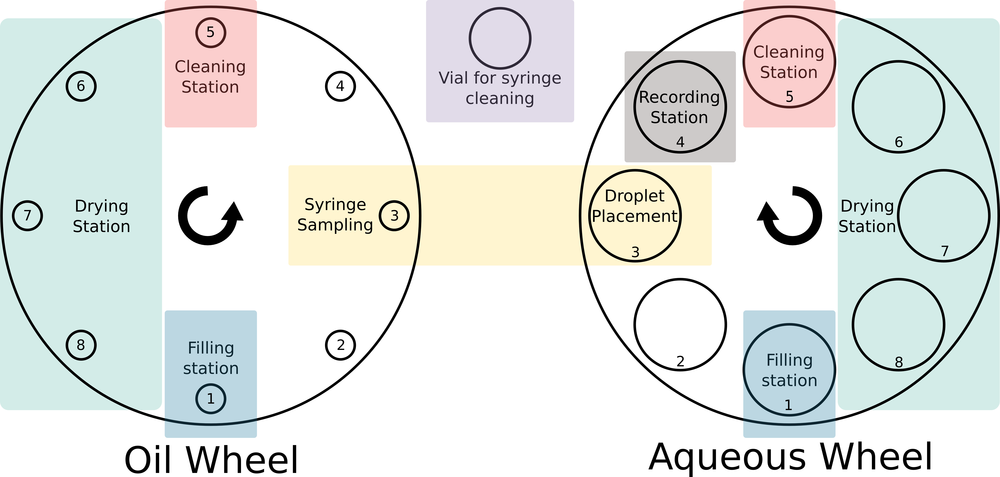

The goal of this documentation is to give the reader a global understanding of the guiding principles behind the design of Dropfactory. We also aim to provide a more detailed understanding of how all the components in this repository work together.

## Principles

An oil-in-water experiment consists of placing small oil droplets (made from an arbitrary mixture of oils) at the surface of an aqueous medium (made from a mixture of aqueous phases); we then need to video record the droplet movements to later analyse them.

To be able to run continuously such experiments, the platform must be able to mix, sample, clean and dry both oils and aqueous phases. Previous designs had to do all such steps in sequence, Dropfactory does them in parallel. To do so the platform is organized as a little factory, enabling to fully parallelize all required operations (mixing, droplet placing, recording, cleaning, drying).

To achieve this, we designed the platform around three important mechanisms:

- a [XYZ CNC frame](cnc_frame.md) that provides both the structural frame and the mechanism to move the syringe around as required to sample oil mixture and place droplets.
- two [geneva wheels](geneva_wheel.md), one for the oils, one for the aqueous phase. They allow to move the containers from one working station to another in a simple and robust way.
- [working stations](working_stations) that perform only one simple task. The vials and dishes are displaced to the working station thanks to the Geneval wheels. Having specialized working station makes the whole system easier to design, build, and fix. In addition, a lot less cables and tubes will be in motion, reducing again the possibility of failure in the system.

In addition, **we made a point to not over-design or over-specify the platform before building it**. Rather we left ourselves room for iterating on the platform while building it and as we encountered problems. For example, most working stations have been redesigned 2 or 3 times after receiving real-world feedback from practical experience.

To achieve this flexibility we based most of our design on [3D printing](https://en.wikipedia.org/wiki/3D_printing) combined with [aluminium profile](http://ooznest.co.uk/V-Slot) technology - enabling us to tune the system on site. This also explains why there is no overall 3D design specifying every detail of the platform down to the last millimetre.

**Dropfactory is a research platform, it has been conceived with modularity in mind** and we encourage the interested reader to adopt a similar approach if they are willing to build their own robot based on our design.

Below are links with more details on each sub-part of Dropfactory:

- [XYZ CNC frame](cnc_frame.md) contains information needed to build and control the XYZ system.
- [Geneva Wheel](geneva_wheel.md) explains how we designed our geneva wheel system, where the 3D files are and where the code for its control is.
- [Modular Linear Actuator](modular_linear_actuator.md) details our small modular syringe system that is used at several places in the platform (syringe + some working stations).
- [Pumps](pumps.md) explain which pumps we are using and how we control them.
- [Working Stations](working_stations) holds all the information about the design of each working station in the platform.
