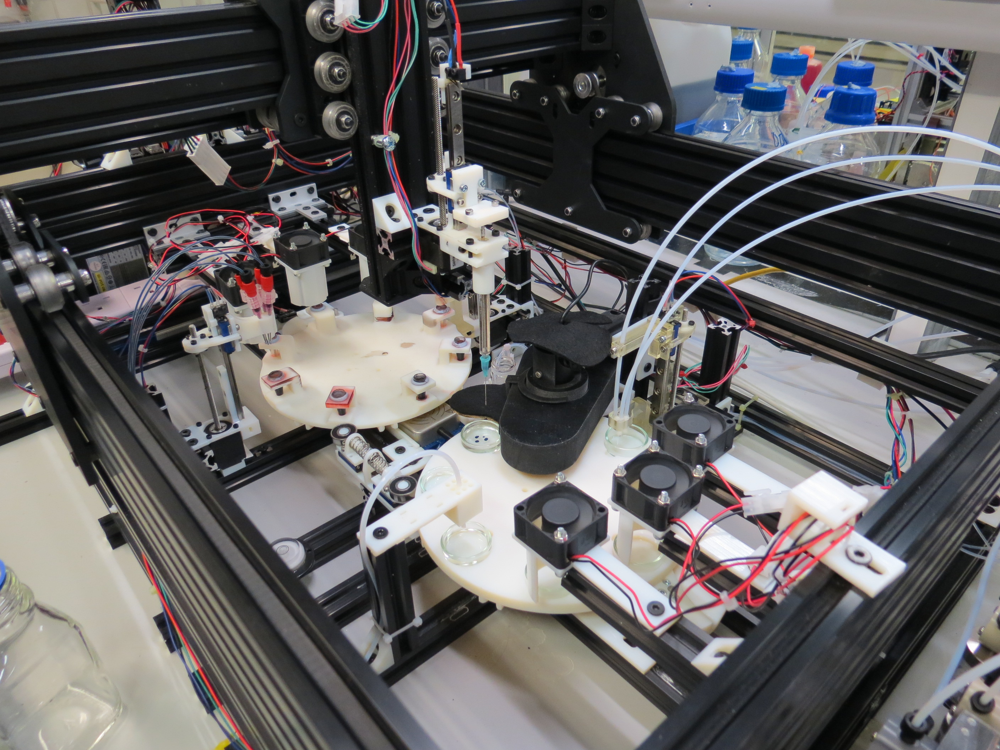
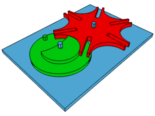
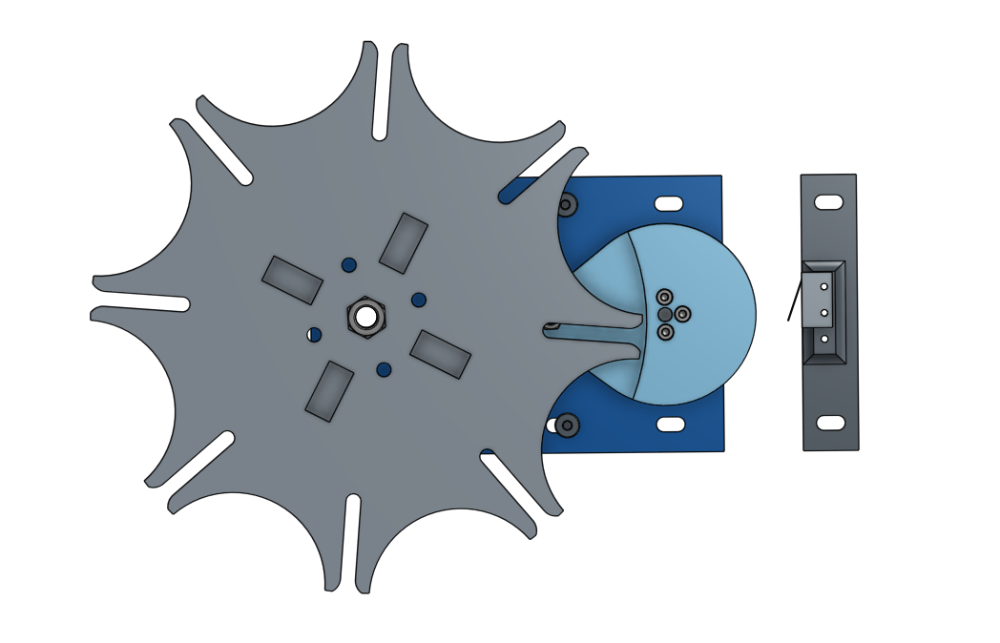
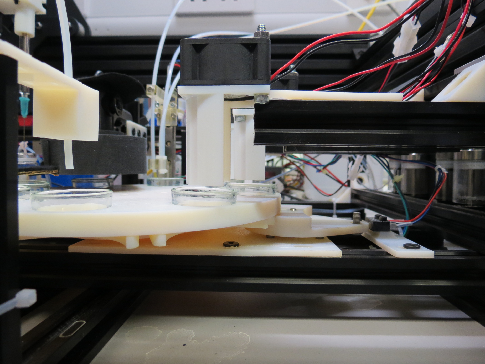
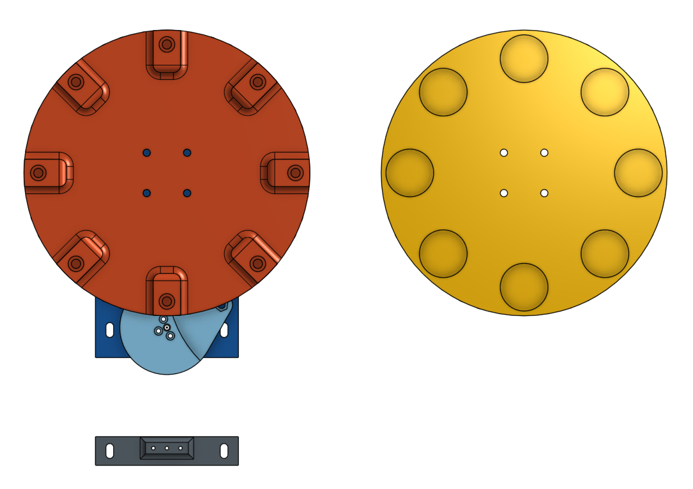
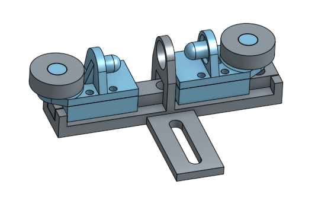

## Geneva Wheels

Two Geneva wheels (1 for the oil, 1 for the aqueous phase) are at the center of the [XYZ CNC frame](cnc_frame.md), they enable to mechanically move the containers to their working station.

### Principle

The mechanism driving a Geneva wheel provides a robust way to precisely turn a shaft from a given angle from a continuous motion of the driving motor. Importantly, the plateau is mechanically locked into position between each turn. The principle is visualized in the animation below.

By <a href="//commons.wikimedia.org/wiki/User:Mike1024" title="User:Mike1024">Mike1024</a> - Transferred from <a class="external text" href="//en.wikipedia.org">en.wikipedia</a> to Commons., Public Domain, <a href="https://commons.wikimedia.org/w/index.php?curid=561907">Link</a>

Useful links:

- Wikipedia page: https://en.wikipedia.org/wiki/Geneva_drive
- Design principles:  https://newgottland.com/2012/01/08/make-geneva-wheels-of-any-size/
- Dimensioning helper: http://benbrandt22.github.io/genevaGen/

### Design

We designed our Geneva wheel system to be modular, compact, and at the same scale as our aluminium profile system, that is by multiple of 20mm.

The basic Geneva module utilize a stepper motor that rotate the driving wheel. The rotating shaft/plateau is dimensioned to have 8 steps per turn and has some fixation patterns enabling to mount different types of plateau on top of the wheel.

We diesnged two plateau, one for handling the oil containers and one for holding the petri dishes.

Finally, to improve the smoothness of the motion we designed a stabilizer that come into contact with both wheel and dampen possible jerk in the wheel motion. The stabilizer is made of two bearing on a sliding axis that are push against one another and contact with the side of the Geneva wheels, providing a slight damping that is enough to stabilize the motion.

### Sources

All the 3d stl files are located in the [hardware/3d_parts/geneva_wheel](hardware/3d_parts/geneva_wheel) folder, along with some visualisation of the parts.

The CAD design file are available on Onshape:

- [Geneva Wheel](https://cad.onshape.com/documents/3aeb7616c1e547bfaae38ba3/w/426b95792e7c48a8b6dd7727/e/30b62a18352c4a91b6bc9828)
- [Geneva Wheel Stabilizer](https://cad.onshape.com/documents/5789121ee4b07256e8184139/w/a0a9bcb1b97b6c43ac68f81e/e/801990910dc3689559c2009a)

The code controlling the synchronous rotation of both wheels is in the [software/robot/robot.py](../software/robot/robot.py) file, more specifically the `rotate_geneva_wheels()` function. Basically we make sure nothing is in the way, then move the driving stepper motor for one turn, which in turn produce a 1/8 rotation of the plateau. We ensure the stepper actually did one turn using a homing switch and raise an error if the stepper does not reach the switch within 30 seconds, indicating the system got stuck somehow.
